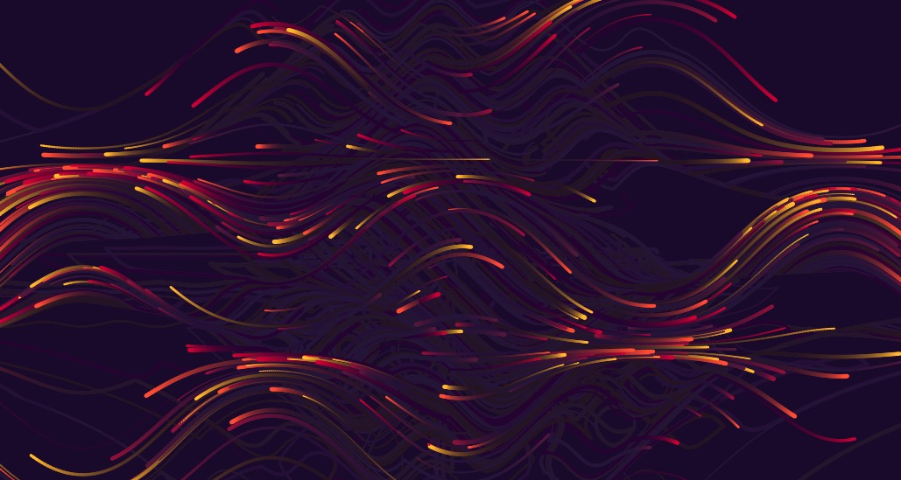
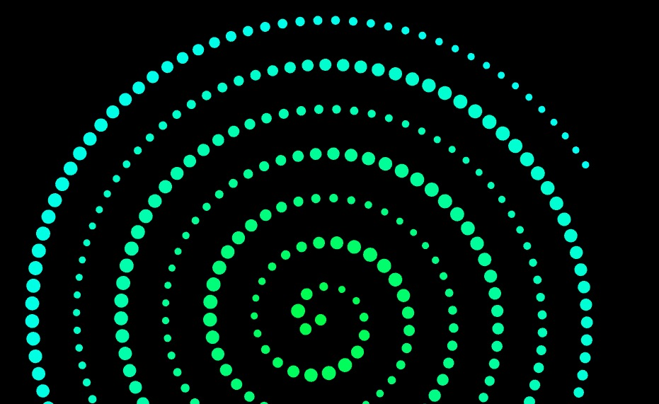

# IDEA9103-Creative-coding-major-project（Audio）

## Instructions for use
- **Click the “Play/Stop Music” button** in the top-left corner to start or stop the music.
- When the music plays:
  - **Particles automatically generate and respond to music amplitude** (volume level)
  - **Particle speed, size, and quantity** dynamically change with the rhythm
  - You can also **click the mouse** to manually create particles at that position
- When the music stops:
  - Existing particles **gracefully fade out** and no new particles are generated

## Details about My Personal Approach to the Animation Group Code

I chose **audio** as the driving force for my individual animation contribution.

The **background portion** of the image is animated, and the particles within that layer **respond dynamically to the loudness of the music**:

- 🎵 The **movement speed** of particles increases as the volume rises
- 🎵 The **size** of particles scales proportionally with amplitude
- 🎵 The **number of particles** automatically generated during each audio burst is based on the real-time volume level

The **visual effects** of particle trajectories are animated using `p5.Vector`, with `HSB` color mode enabled for vibrant color transitions:

- The **transparency (alpha)** of each trail point gradually fades, creating a **motion blur effect**
- Particles achieve **unique and natural movement** by combining amplitude-driven **motion speed** and **density control**

## Inspiration
- The visual inspiration partly comes from the following two works on openprocessing:
  - https://openprocessing.org/sketch/751983 — Inspired by the flow and blurred trail effect of dynamic particles
  

  
 

  - https://openprocessing.org/sketch/2666260 — Inspired my design of audio-triggered particle density and movement rhythm
  

  
 

 
## Technical explanation
I only modified the background part of the original code to enhance the interactive effect between music and vision in the following ways:

 - Use createCanvas() to create an adaptive canvas
 - Use draw() to implement frame loop refresh animation
 - Use mousePressed() to add interactivity
 - createButton() and mousePressed() are used for user interaction (play/pause music, click to generate particles).
 - Use colorMode(HSB) to generate more visually expressive colors.

 **This section covers the key points discussed in class**

 - p5.Amplitude(): Get the overall volume (amplitude) of the current music
 - p5.FFT(): Get the spectrum data (frequency energy distribution)
 
 - **Dynamically adjust the particle generation frequency, size, and speed based on volume. Use the map() function to map volume or frequency values to visual variables (such as color, size)**

 - Use p5.Vector.random2D() to generate random movement directions (unit vectors)
 - Particles gradually fade away (use trail.alpha *= 0.85 to simulate the “trail” effect)
 - **Apply to each particle to record its own movement trajectory and draw the trail visual effect**

 - Use the autoGenerateBlobs() function to control rhythmic generation through rhythm thresholds and frameCount % 10.
 - Use amp.getLevel() (volume) to determine whether to trigger new particles.

 **This part of the function is not included in the original course code and is my expansion of the project**

## External Sources and References

This project integrates techniques and knowledge gathered from the following reputable online resources:

- **p5.js Official Documentation**  
  [https://p5js.org/reference/#/p5.Vector/random2D]
   https://p5js.org/reference/p5/mousePressed/

- **OpenProcessing Community Projects**  
 https://openprocessing.org/sketch/2666260
 https://openprocessing.org/sketch/751983 

- **AI (ChatGPT)**  
It assisted in debugging, improving readability, and ensuring correct application of the p5.sound and p5. Vector APIs while keeping original logic intact.
